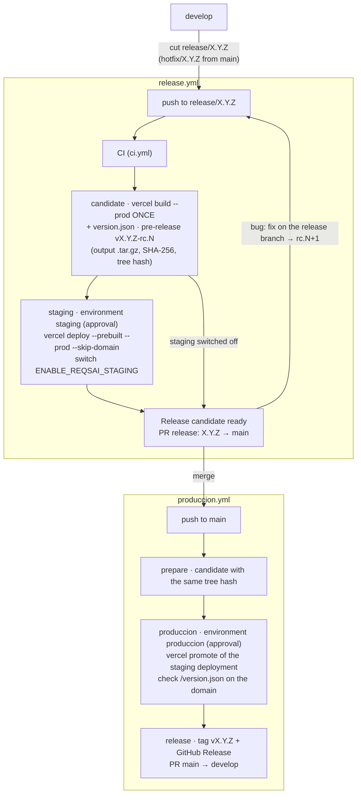

<div align="center">

# ReqsAI — Landing Page


</div>

Landing page for **ReqsAI**, an AI-powered requirements elicitation platform by [Kntro-Soft](https://github.com/kntro-soft) — Lima, Peru.

## Stack

|           |                                                              |
|-----------|--------------------------------------------------------------|
| Framework | React 19 + Vite 8                                            |
| Styling   | Tailwind CSS v4 (CSS-first, no config file)                  |
| Compiler  | React Compiler via `babel-plugin-react-compiler`             |
| i18n      | i18next + react-i18next (ES / EN, persisted in localStorage) |
| Icons     | lucide-react                                                 |

## Sections

Navbar · Hero · Stats · Features · Solutions · Pricing · Testimonials · FAQ · Contact · Footer

## Getting started

```bash
pnpm install
pnpm dev
```

Build for production:

```bash
pnpm build
pnpm preview
```

## i18n

Translation files live in `src/i18n/locales/`. The active language is stored in `localStorage` under the key `reqsai_lang` and defaults to `es`.

## Project structure

```
src/
├── components/
│   ├── layout/       # Navbar, Footer
│   └── sections/     # One file per page section
├── hooks/            # useScrolled
├── i18n/
│   ├── index.js      # i18next setup
│   └── locales/      # es.json, en.json
├── App.jsx
├── main.jsx
└── index.css         # Tailwind entry + @theme + global styles
```

## Contributing, releases and deployment

Work follows the organization guide ([CONTRIBUTING.md](https://github.com/Kntro-Soft/.github/blob/main/.github/CONTRIBUTING.md)):
an issue on the [ReqsAI project board](https://github.com/orgs/Kntro-Soft/projects/3), a branch
`feature/<issue>-<slug>` from `develop`, a pull request with `Closes #<issue>`. `main` and `develop` require a pull
request with 1 approval; **CI** (`.github/workflows/ci.yml`: `pnpm lint` + `pnpm build`) runs on every pull
request and on pushes to `main`, `develop`, `release/**` and `hotfix/**`.

The site is hosted on Vercel. Pull request and branch previews still come from the Vercel Git integration
(no approval, no GitHub environment). **Production does not deploy on pushes to `main` by itself**
(`vercel.json` turns the Git deployment of `main` off). Releases follow the organization flow, **model C + tag at
the end**: the site is built once on the release branch, staged, and the same Vercel deployment is promoted to
production after the merge.



**Release** (`release.yml`, on pushes to `release/**` and `hotfix/**`):

| Job | Environment | What it does |
|-----|-------------|--------------|
| `prepare` | — | Checks that `package.json` says `X.Y.Z` (first commit of a release: `chore(release): X.Y.Z`), numbers the candidate `X.Y.Z-rc.N`, records the tree hash, reads the switches. |
| `ci` | — | Lint and build (`ci.yml`). |
| `candidate` | — | `vercel build --prod` **once**, writes `version.json` (version, build, commit) into the output and stores the output as the asset of the pre-release `vX.Y.Z-rc.N` with its SHA-256. |
| `staging` | `staging` (approval by `jhosepmyr`) | Downloads that asset (SHA-256 checked), deploys it as a production deployment **without the domains** (`--skip-domain`; alias `LANDING_STAGING_ALIAS` if set), checks that it serves `version.json` of this commit and records the deployment in the candidate. |
| `ready` | — | Opens or updates the PR `release: X.Y.Z` with the candidate, the staging URL and the hashes. |

A bug found in staging is fixed on the release branch; the next push builds `rc.N+1`.

**Produccion** (`produccion.yml`, on pushes to `main`): finds the candidate whose tree hash equals the `main`
commit (otherwise it fails: *main differs from the tested candidate*), waits for approval in `produccion`, runs
`vercel promote` of **the same deployment** that staging served (if staging was switched off, it deploys the
stored output with `vercel deploy --prebuilt --prod`), checks `version.json` on `LANDING_URL`, and only then tags
`vX.Y.Z` with a GitHub Release carrying the same output and opens `chore: merge release X.Y.Z back into develop`.

**Rollback** (`rollback.yml`, manual from `main`, input `version`): `vercel promote` of the deployment of that
release (or, if Vercel no longer keeps it, its stored output), behind the `produccion` approval.

Deploy switches (organization variables in *Kntro-Soft → Settings → Secrets and variables → Actions →
Variables*; only `true` turns them on, otherwise the job is skipped and the run summary says why):

| Variable | Controls |
|----------|----------|
| `ENABLE_REQSAI_LANDING_PREVIEW` | `candidate`: the Vercel build (off: CI only, no candidate, so no release) |
| `ENABLE_REQSAI_STAGING` | `staging` (off: the candidate goes straight to the release PR, e.g. an urgent hotfix; production still needs approval) |
| `ENABLE_REQSAI_LANDING_PRODUCCION` | `produccion.yml` and `rollback.yml` |

One-time set-up:

- Secret `VERCEL_TOKEN` (a token of the Vercel account that owns the project) and **repository** variables
  `VERCEL_ORG_ID` and `VERCEL_PROJECT_ID` (from `.vercel/project.json` after `vercel link`).
- Environments: `staging` (required reviewer `jhosepmyr`, branches `release/*` and `hotfix/*`) and `produccion`
  (required reviewer `jhosepmyr`, branch `main`, variable `LANDING_URL`).
- Optional: variable `LANDING_STAGING_ALIAS` (a fixed staging host name) and secret
  `VERCEL_AUTOMATION_BYPASS_SECRET` (lets the staging check read a deployment behind Vercel Deployment
  Protection; without it a protected staging URL is reported, not checked).
- *Allow GitHub Actions to create and approve pull requests* (organization and repository settings) for the
  release and back-merge pull requests; while it is off, the run prints the link to open them.

---

© 2026 Kntro-Soft · Lima, Peru 🇵🇪
