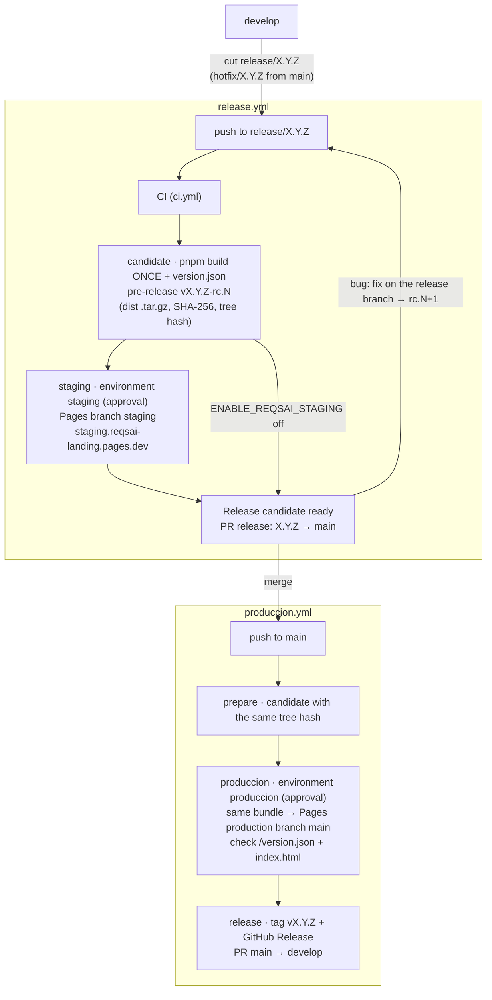

<div align="center">

# ReqsAI — Landing Page


</div>

Landing page for **ReqsAI**, an AI-powered requirements elicitation platform by [Kntro-Soft](https://github.com/kntro-soft) — Lima, Peru.

## Stack

|           |                                                              |
|-----------|--------------------------------------------------------------|
| Framework | React 19 + Vite 8                                            |
| Styling   | Tailwind CSS v4 (CSS-first, no config file)                  |
| Compiler  | React Compiler via `babel-plugin-react-compiler`             |
| i18n      | i18next + react-i18next (ES / EN, persisted in localStorage) |
| Icons     | lucide-react                                                 |

## Sections

Navbar · Hero · Stats · Features · Solutions · Pricing · Testimonials · FAQ · Contact · Footer

## Getting started

```bash
pnpm install
pnpm dev
```

Build for production:

```bash
pnpm build
pnpm preview
```

## i18n

Translation files live in `src/i18n/locales/`. The active language is stored in `localStorage` under the key `reqsai_lang` and defaults to `es`.

## Project structure

```
src/
├── components/
│   ├── layout/       # Navbar, Footer
│   └── sections/     # One file per page section
├── hooks/            # useScrolled
├── i18n/
│   ├── index.js      # i18next setup
│   └── locales/      # es.json, en.json
├── App.jsx
├── main.jsx
└── index.css         # Tailwind entry + @theme + global styles
```

## Contributing, releases and deployment

Work follows the organization guide ([CONTRIBUTING.md](https://github.com/Kntro-Soft/.github/blob/main/.github/CONTRIBUTING.md)):
an issue on the [ReqsAI project board](https://github.com/orgs/Kntro-Soft/projects/3), a branch
`feature/<issue>-<slug>` from `develop`, a pull request with `Closes #<issue>`. `main` and `develop` require a pull
request with 1 approval; **CI** (`.github/workflows/ci.yml`: `pnpm lint` + `pnpm build`) runs on every pull
request and on pushes to `main`, `develop`, `release/**` and `hotfix/**`. `develop` deploys nothing.

The site is a static Vite build hosted on **Cloudflare Pages** (project `reqsai-landing`, production at
<https://reqsai-landing.pages.dev>). Nothing deploys on a push by itself: releases follow the organization flow,
**model C + tag at the end**. The site is built **once** on the release branch, that bundle is staged, and the
**same bytes** go to production after the merge into `main`; `vX.Y.Z` is tagged only when production succeeded.



| Workflow | Trigger | What it does |
|----------|---------|--------------|
| `ci.yml` | pull requests; pushes to `main`, `develop`, `release/**`, `hotfix/**` | `pnpm lint` + `pnpm build` |
| `release.yml` | push to `release/**`, `hotfix/**` | candidate `vX.Y.Z-rc.N` → `staging` (approval) → PR `release: X.Y.Z` |
| `produccion.yml` | push to `main` | candidate by tree hash → `produccion` (approval) → tag `vX.Y.Z` → back-merge PR |
| `rollback.yml` | manual, from `main`, input `version` | redeploys the bundle of a final release `vX.Y.Z` (approval in `produccion`) |

The version lives in `package.json`: the first commit of `release/X.Y.Z` is `chore(release): X.Y.Z` setting it
(the latest release is `v1.2.1`, so the next one is `1.3.0` or higher), plus its `## [X.Y.Z]` section in
[CHANGELOG.md](CHANGELOG.md). The full pipeline, the one-time set-up (Cloudflare secrets, environments,
switches), the custom domain and the rollback are in **[docs/deploy.md](docs/deploy.md)**.

---

© 2026 Kntro-Soft · Lima, Peru 🇵🇪
