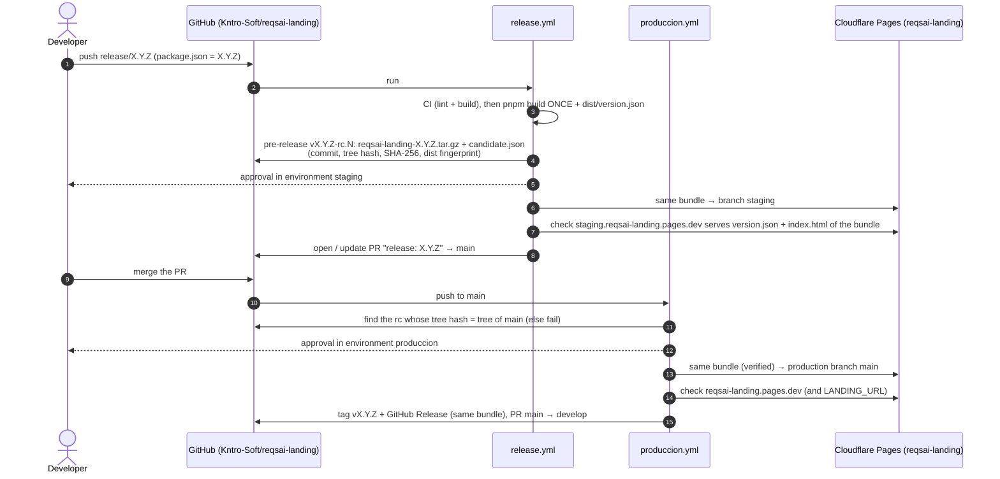

# Deployment and releases

The landing is a static Vite build (`dist/`) served by **Cloudflare Pages**, project **`reqsai-landing`**
(production branch `main`):

| Stage | Pages branch | URL |
|-------|--------------|-----|
| Production | `main` (production branch) | <https://reqsai-landing.pages.dev> (+ the custom domain, once attached) |
| Staging | `staging` (preview branch alias) | <https://staging.reqsai-landing.pages.dev> |

Every deployment also gets its own immutable URL (`https://<hash>.reqsai-landing.pages.dev`), listed in the
Cloudflare dashboard (Workers & Pages → `reqsai-landing` → Deployments). Pages serves `index.html` for unknown
paths (single-page app mode), so `/terminos` and `/privacidad` work without redirects; preview deployments
are sent with `X-Robots-Tag: noindex`.

Nothing deploys on a push by itself and there is no Cloudflare Git integration: the GitHub Actions workflows
below upload the bundle with a pinned Wrangler (`4.149.0`). Pull requests only run CI.

## Release flow: model C + tag at the end

The site is built **once** on the release branch. That bundle (the *candidate*) is stored durably, staged,
and the **same bytes** are deployed to production after the release pull request is merged. The final tag
`vX.Y.Z` is created only after production succeeded.



### Push to `release/X.Y.Z` or `hotfix/X.Y.Z` (`release.yml`)

```
prepare ─┬──────────────┐
ci ──────┴─► candidate ─┴─► staging [environment staging, approval] ─► ready
                       └─────── (staging switched off / no Cloudflare secrets) ─► ready
```

| Job | Environment | What it does |
|-----|-------------|--------------|
| `prepare` | — | `package.json` must say `X.Y.Z` and `vX.Y.Z` must not exist; numbers the candidate `X.Y.Z-rc.N` (N = next free; a re-run of the same commit reuses its rc); records the tree hash; reads `ENABLE_REQSAI_STAGING` and whether the Cloudflare secrets exist. |
| `ci` | — | `ci.yml` (lint + build), so a candidate only comes from a commit that passed CI. |
| `candidate` | — | `pnpm build` **once**; writes `dist/version.json` (`version`, `build` = run number, `commit`); packs `dist/` reproducibly as `reqsai-landing-X.Y.Z.tar.gz`; creates the pre-release `vX.Y.Z-rc.N` on the commit with that archive and `candidate.json`. |
| `staging` | `staging` (approval) | Downloads the archive, verifies it, deploys it to the Pages branch `staging`, checks it and records `staging_url` / `deployment_url` in `candidate.json` (stage `staging`). |
| `ready` (check *Release candidate ready*) | — | Opens or updates the PR `release: X.Y.Z` → `main` with the candidate, hashes and staging URL. When staging did not run, marks the candidate `staging-skipped`. |

A bug found in staging is fixed **on the release branch**; the next push builds `rc.N+1` and updates the PR.
If the branch moved on while a staging approval was pending, that older run deploys nothing (superseded).

### Push to `main` (`produccion.yml`)

```
prepare ─► produccion [environment produccion, approval] ─► release
```

| Job | Environment | What it does |
|-----|-------------|--------------|
| `prepare` | — | Reads `package.json`. If `vX.Y.Z` already exists, nothing to do. Otherwise finds the newest pre-release `vX.Y.Z-rc.N` whose recorded **tree hash equals the tree of this `main` commit** and whose stage is `staging` or `staging-skipped`; none → fails: *main differs from the tested candidate; push the change to the release branch to build a new rc*. Reads `ENABLE_REQSAI_LANDING_PRODUCCION` and the Cloudflare secrets. |
| `produccion` | `produccion` (approval) | Deploys that candidate's bundle (verified, **not rebuilt**) to the Pages production branch `main`, then checks <https://reqsai-landing.pages.dev> and `LANDING_URL` (if different): HTTP 200, `/version.json` of the candidate, `index.html` byte-identical to the bundle. |
| `release` | — | Only if `produccion` deployed: tag `vX.Y.Z` on the `main` commit + GitHub Release with the same archive and `candidate.json` (notes = the CHANGELOG section), then the PR `chore: merge release X.Y.Z back into develop`. |

If `produccion` fails, is rejected or is switched off, **no tag** is created; *Re-run failed jobs* deploys the
same candidate again. The tree hash comparison holds for any merge method as long as `main` has nothing the
release branch lacks; otherwise merge `main` into the release branch first (which builds a new candidate).

### Rollback (`rollback.yml`)

Actions → **Rollback** → *Run workflow* from `main`, input `version` (e.g. `1.3.0`). After the approval in
`produccion` it downloads the bundle of the final GitHub Release `vX.Y.Z`, verifies it against that release's
`candidate.json` and deploys it to the production branch, then runs the same checks. It never builds. The
landing holds no data, so there is nothing to restore; tags do not change: fix forward with
`hotfix/X.Y.Z+1`.

Releases made before this pipeline (`v1.0.0` … `v1.2.1`) carry no bundle. For those, use the dashboard:
Workers & Pages → `reqsai-landing` → Deployments → ⋯ → *Rollback to this deployment*. (Cloudflare's own
rollback is also the fastest way back to any earlier deployment in an emergency.)

### How the bytes are proven to be the same

- `candidate.json` (asset of the pre-release, copied into the final release) records the commit, the git
  tree hash, the build number, the SHA-256 of the archive and the **fingerprint of `dist/`** (one SHA-256
  over every path and content).
- Before every deploy (staging, production, rollback) the archive's SHA-256 is checked against
  `candidate.json` and against the digest GitHub computed on upload, and the unpacked `dist/` fingerprint is
  recomputed.
- After every deploy the URL must serve `/version.json` with the candidate's version and commit, and `/`
  must be byte-identical to the bundle's `index.html`.
- `version.json` never says "rc": the same file is in staging and production; <https://reqsai-landing.pages.dev/version.json>
  tells what is live.

## Version file

`package.json` → `version` is the release version. The first commit of `release/X.Y.Z` (or
`hotfix/X.Y.Z`) is `chore(release): X.Y.Z` setting it, together with the `## [X.Y.Z]` section of
[CHANGELOG.md](../CHANGELOG.md). The latest release is **`v1.2.1`**, so the next release is **`1.3.0`** or
higher (a hotfix of 1.2.1 would be `1.2.2`). `develop` still says `1.0.0`; the release branch fixes it.

## Switches

Organization variables (*Kntro-Soft → Settings → Secrets and variables → Actions → Variables*; only `true`
turns them on, otherwise the job is skipped and the run summary says why):

| Variable | Controls |
|----------|----------|
| `ENABLE_REQSAI_STAGING` | `release.yml` → `staging`. Off: the candidate goes straight to the release PR (e.g. an urgent hotfix); production still needs its approval. |
| `ENABLE_REQSAI_LANDING_PRODUCCION` | `produccion.yml` → `produccion` (and so the tag) and `rollback.yml`. |

`ENABLE_REQSAI_LANDING_PREVIEW` (the Vercel build) is no longer used: the candidate is always built.

## One-time set-up

1. **Repository secrets** (*reqsai-landing → Settings → Secrets and variables → Actions → Secrets*):
   - `CLOUDFLARE_API_TOKEN`: dashboard → My Profile → API Tokens → Create Token → Create Custom Token,
     permission **Account · Cloudflare Pages · Edit**, account resources *Include · the account that owns
     `reqsai-landing`*.
   - `CLOUDFLARE_ACCOUNT_ID`: the ID of that account (dashboard → Workers & Pages, right column).

   ```bash
   gh secret set CLOUDFLARE_API_TOKEN --repo Kntro-Soft/reqsai-landing
   gh secret set CLOUDFLARE_ACCOUNT_ID --repo Kntro-Soft/reqsai-landing
   ```

   Without them the candidate is still built and stored, staging and production are skipped and say why.
2. **Environments** (already exist): `staging` (required reviewer, branches `release/*`, `hotfix/*`) and
   `produccion` (required reviewer, branch `main`). In `produccion`, set the variable **`LANDING_URL`** to
   `https://reqsai-landing.pages.dev` (or the custom domain once attached); while it still points to
   `vercel.app` the production job stops before deploying.
3. *Allow GitHub Actions to create and approve pull requests* (organization and repository) for the release
   and back-merge PRs; while it is off, the run prints the link to open them by hand.
4. Optional: require the checks `Lint & build` and `Release candidate ready` on `main`.

The Pages project is created by the first deploy if it does not exist
(`wrangler pages project create reqsai-landing --production-branch main --force`).

## Custom domain

`reqsai.tech` (A → the EC2 host) and `www.reqsai.tech` are served by Caddy in `reqsai-infra`: the apex is
the web app and the API (`/api/*`), and `www` redirects to the apex. The landing's sign-in and sign-up
buttons point to `https://reqsai.tech/auth/...`, so the landing cannot take the apex without moving the app.

- **Now:** attach `www.reqsai.tech` to the Pages project (Workers & Pages → `reqsai-landing` → Custom
  domains), then at the DNS provider replace the `www` A record with `CNAME www → reqsai-landing.pages.dev`,
  and drop `www.reqsai.tech` from the Caddy redirect hostnames (`app_redirect_hostnames` in
  `reqsai-infra`). Then set `LANDING_URL=https://www.reqsai.tech`. A subdomain on Pages works with DNS
  outside Cloudflare.
- **Later (optional):** landing on the apex and the app on `app.reqsai.tech`. An apex domain on Pages
  needs the zone on Cloudflare (nameservers moved from the current provider), plus the app's hostname,
  OAuth redirect URIs and `VITE_APP_URL` of the landing changed together.

## Leaving Vercel

The landing used to be served by Vercel at `reqsai-landing.vercel.app`, and the Vercel GitHub integration
still builds previews (environments `Preview – reqsai-landing` / `Production – reqsai-landing`). Once
Cloudflare serves production: disconnect the Git repository in the Vercel project (or delete the project) so
Vercel stops deploying, and remove those two GitHub environments. `vercel.json` was removed from the repo.
